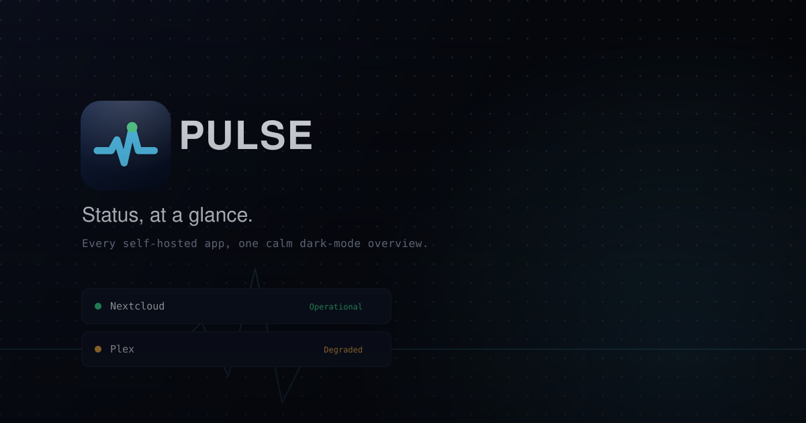

<p align="center">
  
</p>

# Pulse

**Status, at a glance.**

A self-hosted status page for the apps you run — GitHub-Status-style uptime
bars, light and dark, English and German, no auto-discovery. You add the services yourself; Pulse checks
them on a schedule and shows what's up, what's slow, and what's down.

## Features

- **Manually curated services** — edit `data/services.json`, no scanning or
  discovery of any kind. Only what you list ever shows up.
- **Real health checks** — a periodic HTTP request per service (default every
  60s), with an optional specific path and expected status code if the root
  URL isn't a meaningful check.
- **Three states, not just up/down** — *operational*, *degraded* (recent
  failures or slow responses), *down*, derived automatically from check
  history — no manual thresholds to babysit.
- **90-day uptime bars** — GitHub-Status-style daily ticks per service. Point
  at a day, tap or drag across the bar on a phone, or use the arrow keys, and
  the line under it shows that day's date, uptime and average response time.
- **The state, before the details** — a headline in the state's colour with
  how many services are up, the median response time and the last check; the
  page's glow takes the same colour, and the tab title names what's down.
- **Light and dark, English and German** — following the device, with a
  switch for each in the footer (kept in the browser, applied before first
  paint by `public/theme.js`).
- **Live-streamed** — updates over Server-Sent Events; the page never needs a
  manual refresh, and it reconnects by itself after a restart or a deploy.
- **Installable, and opens offline** — add it to a home screen. Without a
  connection it opens to the last status it received, labelled "Last known"
  with its time, never presented as current.
- **Only public links are published** — the `url` Pulse checks stays on the
  server (it may well be a LAN address); the page links a service only if you
  give it a `link`, and shows check errors as codes (`ECONNREFUSED`), not
  messages that could carry a hostname.
- **One container** — the built frontend is served by the same Express
  process as the API, so deployment is a single Docker image + one bind-mounted
  data folder.

## Configuring services

Edit `data/services.json` — an array of:

```json
[
  {
    "id": "nextcloud",
    "name": "Nextcloud",
    "url": "https://nextcloud.example.com",
    "healthPath": "/status.php",
    "expectedStatus": 200,
    "link": "https://nextcloud.example.com",
    "description": "Optional subtitle shown under the name",
    "group": "Optional category heading"
  }
]
```

Only `id`, `name`, and `url` are required. `id` must be stable and unique —
it's the key uptime history is stored under, so renaming a service's `id`
starts its history over. See `data/services.example.json` for more examples.

Changes are picked up on the **next poll cycle** — no restart needed.

| Field            | Required | Notes                                                             |
| ---------------- | -------- | ------------------------------------------------------------------ |
| `id`             | yes      | Stable slug; history is keyed by this, not by name.                |
| `name`           | yes      | Display name.                                                      |
| `url`            | yes      | Base URL used for the check. Never sent to the page.               |
| `healthPath`     | no       | Path appended to `url` for the actual check request.                |
| `expectedStatus` | no       | Exact status code required to count as "up" (default: any 2xx–3xx).|
| `link`           | no       | Public link on the service's name. Without it, the name isn't a link. |
| `description`    | no       | Small subtitle under the name.                                     |
| `group`          | no       | Services sharing a `group` are clustered under that heading.       |

## Local development

```bash
npm run install:all
npm run dev
```

Client: **http://localhost:5174**. API: `http://localhost:4400` (proxied
through `/api` in dev, same-origin in production — no CORS config needed
either way).

The service worker is registered in production builds only, so to try
install and offline, build and run the production server:

```bash
npm run build && npm start   # http://localhost:4400
```

Checks, the same ones CI runs:

```bash
npm run check --prefix server && npm run check --prefix client
npm run lint --prefix client
npm test --prefix server       # the state rules
```

## Deploying

A push to `release` is the deploy: CI (`.github/workflows/ci.yml`) typechecks,
lints, runs the tests, builds and smoke-tests the production server; only then
does `docker-publish.yml` push `ghcr.io/ewolution94/pulse:latest` (amd64 and
arm64). The shared Watchtower on the NAS picks up the new image within about
five minutes, for containers that carry its label.

The NAS runs `deploy/portainer-stack.yml`: paste it into Portainer's stack
editor. It pulls the published image; the repo's `docker-compose.yml` builds
from source instead and is for trying the image locally:

```bash
docker compose up -d --build
```

Either way `data/` is mounted into the container, so `services.json` and the
check history survive restarts and updates. Point the reverse proxy (or the
Cloudflare Tunnel) at port `4400`. Pulse doesn't care about the domain; it has
no hardcoded origin.

The server sends a strict Content-Security-Policy (same origin only, no inline
scripts or styles), so the page makes no third-party request: the fonts are
self-hosted under `client/public/fonts`.

### Install and offline

`client/public/sw.js` is a small service worker. Page loads go to the network
first, so a deploy reaches an installed copy on its next open; the fingerprinted
files under `/assets/`, the fonts and the icons go to the cache first. It never
touches `/api/`: the page keeps the last status it received in `localStorage`
and shows it, marked "Last known" with its time, when the stream can't connect.

The home-screen icons are rendered from `brand/app-icon.svg` and
`brand/app-icon-maskable.svg`, and the social preview `client/public/og.png`
from the Pulse drawing on ewolution.cloud, both by the tools in the
landing page's repo (`tools/app-icons`, `tools/og-apps`). Bump the `?v=` on `og:image` in `client/index.html` when the
preview changes, so link caches fetch it again.

### Environment variables

| Variable                     | Default | Purpose                                      |
| ----------------------------- | ------- | --------------------------------------------- |
| `PORT`                        | `4400`  | Port the server listens on.                    |
| `PULSE_DATA_DIR`               | `./data`| Where `services.json`/`history.json` live.     |
| `PULSE_POLL_INTERVAL_MS`       | `60000` | How often each service is checked.             |
| `PULSE_CHECK_TIMEOUT_MS`       | `10000` | Per-check timeout before it counts as down.    |
| `PULSE_RETENTION_DAYS`         | `90`    | How many days of history to keep per service.  |
| `PULSE_DEGRADED_LATENCY_MS`    | `3000`  | Response time above which an "up" check still counts toward *degraded*. |

## How state is derived

- **down** — the most recent check failed.
- **degraded** — the most recent check succeeded, but either one of the last
  5 checks failed, or the response was slower than `PULSE_DEGRADED_LATENCY_MS`.
- **operational** — recent checks are clean and fast.
- **unknown** — no checks yet (freshly added service, or Pulse itself was
  offline).

Overall page status is the worst of any individual service's state.

## Tech stack

- **Server**: Node.js, Express, TypeScript, Server-Sent Events, zero
  database — JSON files under `data/`.
- **Client**: React 19, TypeScript, Vite, Tailwind CSS v4, lucide-react.

## Project structure

```
pulse/
├── .github/workflows/      ci.yml (the checks), docker-publish.yml (the image)
├── brand/                 brand assets (logo, favicon, banner, app icons)
├── data/
│   ├── services.json      your real config (gitignored)
│   ├── services.example.json
│   └── history.json       check history (gitignored, auto-managed)
├── server/src/
│   ├── config.ts          env vars, services.json loading/validation
│   ├── healthCheck.ts     a single HTTP check with timeout
│   ├── historyStore.ts    daily-aggregate history persistence
│   ├── index.ts           poll loop, API + SSE, headers, static serving
│   ├── state.ts           down / degraded / operational / unknown (+ state.test.ts)
│   └── types.ts
├── client/public/         sw.js, theme.js, manifest, icons, fonts, og.png
├── client/src/
│   ├── components/        StatusHero, ServiceRow, UptimeBar, Backdrop, PulseMark…
│   ├── hooks/              useStatus (SSE + last known status), useClock
│   └── lib/                i18n (EN/DE), prefs (theme, language), format, dayWindow, state colors
├── deploy/
│   └── portainer-stack.yml the stack the NAS runs
├── Dockerfile              multi-stage build → single runtime image
└── docker-compose.yml      local build from source
```

## What this deliberately doesn't do

- No auto-discovery of any kind — you add every service by hand.
- No process control — Pulse can't start/stop/restart anything, only check
  if it responds. It has no business managing processes on a machine it
  doesn't own.
- No incident-management workflow (manual "investigating" notes, subscriber
  notifications) — just live status and history. Worth adding later if it
  turns out to matter.
